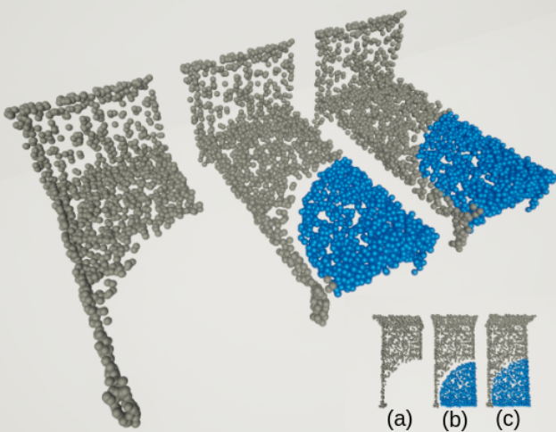
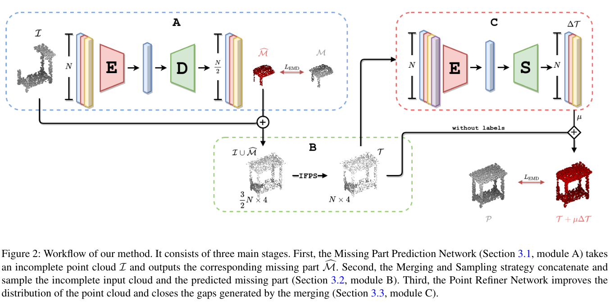
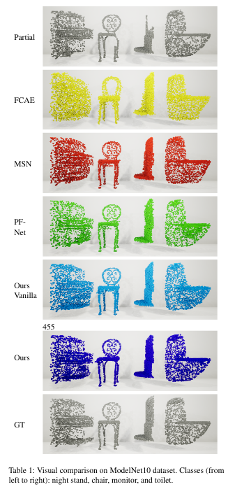

<!-- [![Contributors][contributors-shield]][contributors-url] -->
<!-- [![Forks][forks-shield]][forks-url]
[![Stargazers][stars-shield]][stars-url]
[![Issues][issues-shield]][issues-url]
[![MIT License][license-shield]][license-url] -->
[![LinkedIn][linkedin-shield]][linkedin-url]

<!-- PROJECT LOGO -->
 

<h3 align="center">Learning to Predict Missing Parts for Point Cloud Completion (preprint implementation)</h3>

  

    This project has the code used in our first preprint version of "Refinement of Predicted Missing Parts Enhance Point Cloud Completion" (https://arxiv.org/abs/2010.04278)
     
  

<!-- ABOUT THE PROJECT -->
## About The Project

<!-- [![Product Name Screen Shot][product-screenshot]](https://example.com) -->

Point cloud completion is the task of predicting complete geometry from partial observations using a point set representation for a 3D shape. Previous approaches propose neural networks to directly estimate the whole point cloud through encoder-decoder models fed by the incomplete point set. By predicting the complete model, the current methods compute redundant information because the output also contains the known incomplete input geometry. This paper proposes an end-to-end neural network architecture that focuses on computing the missing geometry and merging the known input and the predicted point cloud. Our method is composed of two neural networks: the missing part prediction network and the merging-refinement network. The first module focuses on extracting information from the incomplete input to infer the missing geometry. The second module merges both point clouds and improves the distribution of the points. Our experiments on ShapeNet dataset show that our method outperforms the state-of-the-art methods in point cloud completion. 

(<a href="#top">back to top</a>)

### Built With

* [Pytorch](https://pytorch.org/)

(<a href="#top">back to top</a>)

<!-- GETTING STARTED -->
## Getting Started

This repository is outdated. Please see visit the current repository at [https://github.com/ivansipiran/Data-driven-cultural-heritage]

## Some results

<!-- [![Product Name Screen Shot][product-screenshot]](https://example.com) -->

 Comparison: 

<!-- CONTACT -->
## Contact

Alexis Mendoza - amendozavil@unsa.edu.pe - alexis@paulonia.dev

Project Link: [https://github.com/texsmv/lsbp_background_subtraction](https://github.com/texsmv/lsbp_background_subtraction)

(<a href="#top">back to top</a>)

<!-- MARKDOWN LINKS & IMAGES -->
<!-- https://www.markdownguide.org/basic-syntax/#reference-style-links -->
[contributors-shield]: https://img.shields.io/github/contributors/github_username/repo_name.svg?style=for-the-badge
[contributors-url]: https://github.com/texsmv/lsbp_background_subtraction/graphs/contributors
[forks-shield]: https://img.shields.io/github/forks/github_username/repo_name.svg?style=for-the-badge
[forks-url]: https://github.com/github_username/repo_name/network/members
[stars-shield]: https://img.shields.io/github/stars/github_username/repo_name.svg?style=for-the-badge
[stars-url]: https://github.com/github_username/repo_name/stargazers
[issues-shield]: https://img.shields.io/github/issues/github_username/repo_name.svg?style=for-the-badge
[issues-url]: https://github.com/github_username/repo_name/issues
[license-shield]: https://img.shields.io/github/license/github_username/repo_name.svg?style=for-the-badge
[license-url]: https://github.com/github_username/repo_name/blob/master/LICENSE.txt
[linkedin-shield]: https://img.shields.io/badge/-LinkedIn-black.svg?style=for-the-badge&logo=linkedin&colorB=555
[linkedin-url]: https://www.linkedin.com/in/alexismv/
[product-screenshot]: images/screenshot.png

